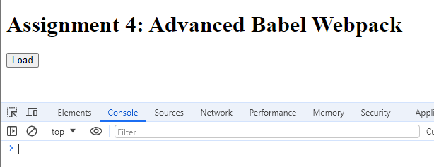
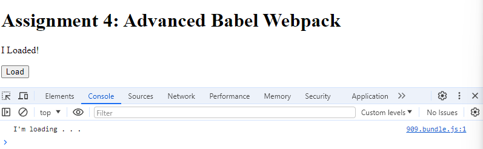
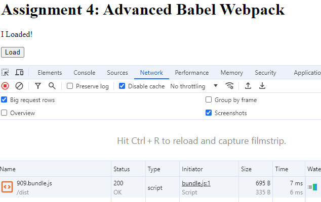

# Advanced Babel Webpack

## Objective

Enhance your JavaScript application by integrating advanced Babel and Webpack configurations. This assignment focuses on applying dynamic imports for code splitting and optimizing your bundle size through tree shaking.

## Project Overview

This project demonstrates the use of advanced configurations with Babel and Webpack, focusing on dynamic imports for code splitting and tree shaking for optimizing bundle size.

## Project Setup

### Installing Dependencies

Before you begin, make sure you have Node.js and npm installed on your machine. Then, follow these steps to set up your project:

1. Create a repository and clone it down:

```bash
git clone ${github URL located in <>Code/Local}
cd ${project/repo name}
```

2. Initialize as a npm project:

```bash
npm init -y
```

3. Install Webpack, Babel, and necessary loaders:

```bash
npm install webpack webpack-cli --save-dev
npm install --save-dev @babel/core @babel/cli @babel/preset-env
npm install -D babel-loader @babel/core @babel/preset-env webpack

```

### Configuring Webpack + Babel

Create a `webpack.config.js` file in root directory:

```js
const path = require("path");

module.exports = {
  entry: "./src/index.js",
  output: {
    filename: "bundle.js",
    path: path.resolve(__dirname, "dist"),
  },
  mode: "production",
  module: {
    rules: [
      {
        test: /\.(?:js|mjs|cjs)$/,
        exclude: /node_modules/,
        use: {
          loader: "babel-loader",
          options: {
            presets: [["@babel/preset-env", { targets: "defaults" }]],
          },
        },
      },
    ],
  },
  optimization: {
    splitChunks: {
      // include all types of chunks
      chunks: "all",
    },
  },
};
```

### Package.Json

In `package.json` add the following to scripts:

```json
"scripts": {
    "build": "webpack"
  },
```

## Building and Testing

After the script is setup in `package.json` file, run the following command to build application:

```bash
npm run build
```

This command will generate a bundle.js file inside the dist directory, which includes all the bundled and optimized code.

### Testing the Project

I used Live Server in VSCode to open a local browser.

#### **Testing Dynamic Imports :**

To test dynamic imports, open local webpage in a browser and click the "Load" button. Once clicked, open Dev Tools and go to 'Network' tab. A new file/chunk should be loaded, indicating that dynamic imports and code splitting are working as expected.

#### **Verfiy Tree Shaking :**

To verfiy shaking, make sure it's enabled with the object property `mode` being set to production in the Webpack Config file. After building the project, examine the bundled JavaScript file - `bundle.js`. Verfiy that unused code snippets are absent from bundled file. If tree shaking is successful, Webpack should eliminate this dead code during the bundling process, resulting in a smaller bundle size. For example, the `unusedFunction` from `module1.js` isn't utilized anywhere and was removed from the final bundled file. Whereas, the `loading` function from `module1.js` appears in the bundled file because it was utilized and executed.

## Screenshots

Intitial Site:  
  
Testing:  

Network Tab:  

